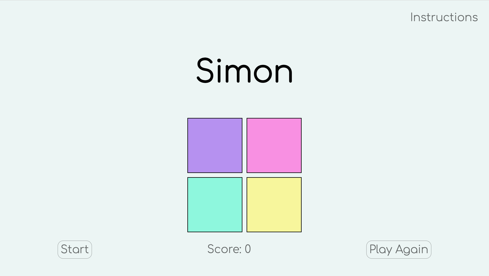
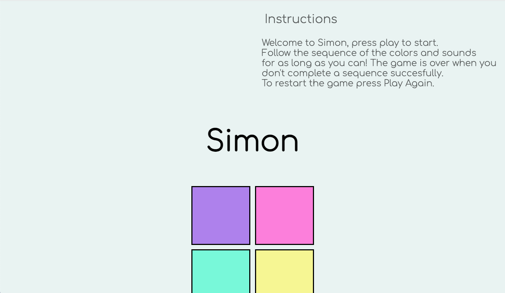
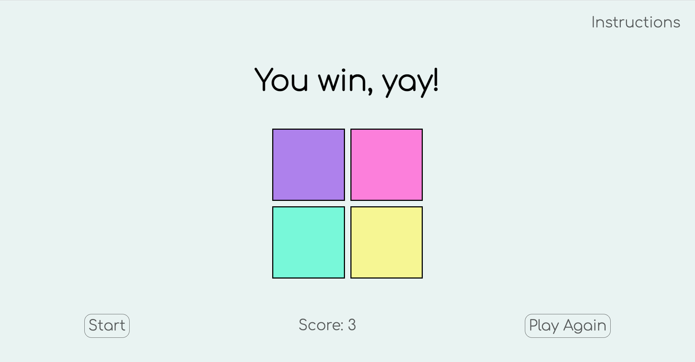
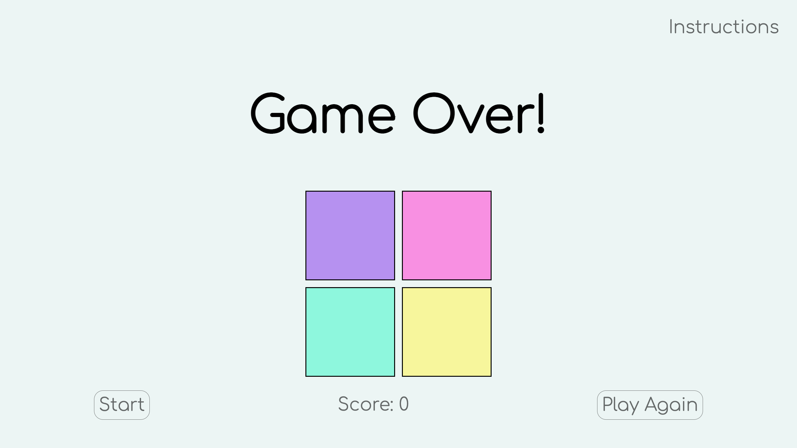

# Simon 
## Description
Simon is a memory game in which the computer generates a sequence of sounds and colors and requires the player to repeat the sequence. If the player succeeds, the series becomes progressively longer adding one extra color in each round. Once the user does not match the same sequence of the computer the game is over. In this version of the game you become a winner by following the sequences five times successfully. To restart the game you may press the 'Play Again' button. 
## Screenshots
- Start screen

- Instructions

- Winner

- Game over

## Technologies Used
- JavaScript
- HTML
- CSS
- Audios courtesy: [Free Code Camp](https://www.freecodecamp.org")

## Getting Started
[Click to Play Simon!](https://danielamansolino.github.io/Simon/)

Welcome to Simon, press play to start. Follow the sequence of the colors and sounds. In this version of the game you become a winner by following the sequences five times succesfully!. You can keep playing after you win to get a higher score. The game is over when you don't complete a sequence successfully.To restart the game press Play Again.

## Planned Future Enhancements
- I would like to add an audio to play when the game is over.
- I would like to generate a high score board.