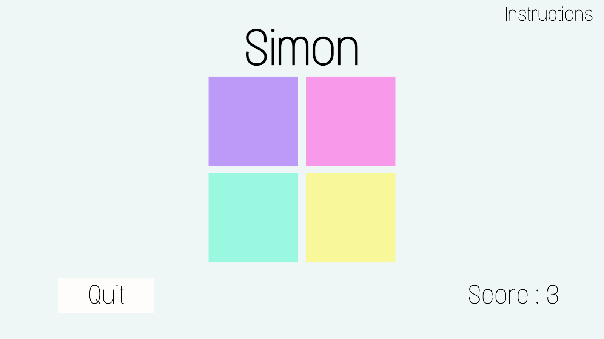
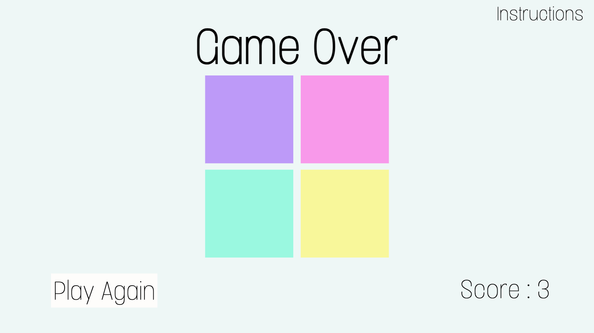

# Planning for Simon 
## Analyze the app's functionality

MVP

What is the least amount of work that I need to do in order to release this item.

As a player ...
- I want to be able to have 1 player, because that is how Simon is played.
- I want to be able to have a color/sound sequence into 4 cells to folllow.
- I want to be able to track the score.
- I want to be able to keep playing the next sequence if I did not have any mistakes.
- I want to be able to quit.
- I want to be able to play again after the game is over.

Bonus user stories:
- I want to know the highest score.
    - Highest score board.
- I want to display the instructions. 

## Think about the overall design (look & feel) of the app
- Clean/minimalists 
- Pink, purple, turquoise, yellow colors for the buttons.
- Font 
```html
<link rel="preconnect" href="https://fonts.googleapis.com">
<link rel="preconnect" href="https://fonts.gstatic.com" crossorigin>
<link href="https://fonts.googleapis.com/css2?family=Comfortaa:wght@300&display=swap" rel="stylesheet">
```

```css
font-family: 'Comfortaa', cursive;
```
- 5 Audios (Do, Re, Mi, Fa, Mistake)
1. Do
```html
<audio src="https://freesound.org/people/Jaz_the_MAN_2/sounds/316898/" data-sound="purple" ></audio> 
```
2. Re
```html
<audio src=" https://freesound.org/people/Jaz_the_MAN_2/sounds/316908/" data-sound="pink" ></audio>   
```
3. Mi
```html
<audio src="https://freesound.org/people/Jaz_the_MAN_2/sounds/316906/" data-sound="turquoise" ></audio>    
```
4. Fa
```html
<audio src="https://freesound.org/people/Jaz_the_MAN_2/sounds/316904/" data-sound="yellow" ></audio>   
```
5. Mistake
```html
<audio src="https://freesound.org/people/thisusernameis/sounds/426890/" data-sound="mistake" ></audio>   
```

## Wireframe the UI

- Start screen wireframe

- Game in progress-quit wireframe

- Game over-play again wireframe


## Pseudocode 
1) Define required constants:
    1.1) Color constant - hold the values of my button color. Why should this be a constant? Colors are not going to change while we are playing the game.

2) Define required variables used to track the state of the game:
    2.1) Game sequence - color 
    2.2) Player sequence - empty array of the player color buttons selected.
    2.3) Score - empty array to keep track of the player's progress
    2.4)Use the winner variable to represent the levels to win or a game over.
    
    
3) Cache DOM elements:
    3.1) Header
    3.2) Game board buttons
    3.3) Start button
    3.4) Score message
    3.5) Audios

4) Upon loading the app should:
    4.1) Initialize the state variables,
        4.1.1) A single array of 4 'null' to represent the 4 color/buttons on the board.
        4.1.3) A score variable to keep track of the player's score.
    4.2) Render those values to the page
        4.2.1) Render the board:
            4.2.1.1) Loop over each of the 4 elements that represent the squares on the page, and for each iteration:
                4.2.1.1.2) Use the index of the iteration to access the mapped value from the board array.
                4.3.1.1.3) Set the background color of the current element by using the value as a key on the colors lookup object (constant).
            4.2.2) Render a messages:
                4.2.2.1)Score button: 
                4.2.2.1.1) If score has a value other than null (game still in progress), render the number to the current score. 
                4.2.2.2.2) Otherwise, render current score to 0.
                4.2.2.2)Start button:
                4.2.2.2.1) If the 'Start' button is clicked (game in progress)render message button to'Quit'.
                4.2.2.2.2) If the game sequence and the player sequence are different render start button message to 'Press to play again'.
                4.2.2.3) If  the game is over (player sequence is different than game sequence) render 'Simon' header to 'Game Over'
    4.3) Wait for the user to interact.

5) Game sequence generator:
    5.1) Generate a ramdom color(by iterating the COLOR array) to start the game sequence.
    5.2) Add a new color to the game sequence each time the player sequence match the last game sequence.
    5.3) Define a function to play the game sequence:
        5.3.1) Loop through each color in the game sequence.
        5.3.2) Turn on the ligth on the corresponding color/button.
        5.3.3) Set a timer for 1 second.
        5.3.4) Turn off the ligth on the corresponding color/button. 

6) Handle a player clicking a button:
    6.1) Obtain the index of the square that was clicked by looping through the cached color board elements using a for loop and breaking out when the current square element equals the event object's target.
    6.2) Check if the button clicked by the player is the same than the game sequence.
    6.3) If the player clicked button is the same as the game sequence increase the player progress.
    6.4) If the player has completed a secuence, add a new color to the sequence and Re-render the board.
    6.5) If the color clicked is different than the sequence the game is over.
    6.6) Re-render the board with the player move.
    6.7) Update the score variable. 

7) Handle a player clicking the play again button
    7.1) Reset the state vars.
    7.2) Render the board.

## Identify the application's state (data)
  
- Game board - 1 array of 4 colors
```js
const COLORS
```
- Game sequence var - empty array to hold the color sequence of the game 
```js
let gameSequence = [];
```
- Player sequence var - empty array to hold the color sequence of the player 
```js 
let playerSequence = [];
```
- Score var - empty array to keep track of the player's progress
```js
let score = [];
```
- Player progress var - empty array to keep track of the winner

```js
let winner =[];
